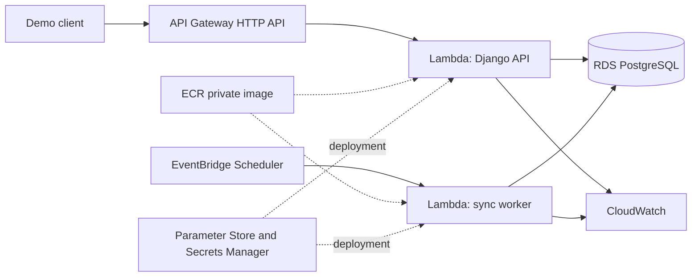

# ADR 0003: Use a serverless AWS baseline and retain the PostgreSQL job queue

- Status: Accepted for implementation; not deployed
- Date: 2026-09-29

## Context

The local vertical slice runs a Django API, a continuously polling worker, and PostgreSQL. It
demonstrates atomic order acceptance, layered idempotency, recoverable failures, inventory
reservation, and an audit trail.

The first AWS version is a low-traffic public portfolio demonstration. It must preserve those
guarantees, fit the account's six-month Free-plan constraints, and avoid infrastructure whose
idle cost is disproportionate to the workload.

The complete comparison is in
[the AWS architecture evaluation](../aws-architecture-evaluation.md).

## Decision

Use the following baseline in `us-east-1`:

- API Gateway HTTP API invokes a Django API Lambda function.
- The API and worker use one container image from a private ECR repository with separate
  handlers.
- EventBridge Scheduler invokes the worker Lambda once per minute.
- The worker claims a bounded number of due PostgreSQL jobs per invocation.
- RDS for PostgreSQL uses a private, encrypted, Single-AZ `db.t4g.micro` instance with 20 GiB.
- The existing `SyncJob` table remains the durable queue.
- Parameter Store Standard holds non-sensitive configuration.
- One Secrets Manager secret holds database credentials and the Django secret key.
- CloudWatch receives structured logs, service metrics, and a minimal alarm set.
- Lambda reserved concurrency bounds database connections.
- The functions and RDS use private subnets; the baseline creates no NAT gateway.
- Secrets are resolved during deployment, so the functions require no AWS data-plane or
  internet access at runtime beyond their private RDS connection.

Cloud retry delays are configured as 60 and 300 seconds to match one-minute worker scheduling.
Local development retains the faster 5 and 30 second defaults.

Do not create Amazon SQS in the first deployment. If SQS is introduced later, keep `SyncJob` as
a transactional outbox until message publication is confirmed, use a Standard queue and DLQ,
and preserve consumer idempotency.

## Consequences

### Positive

- Lambda and API Gateway avoid continuously running API and worker compute.
- The current PostgreSQL transaction keeps order acceptance and job creation atomic.
- The domain model and Atlas port remain independent from AWS infrastructure.
- One image preserves parity between local and cloud execution.
- RDS supports the PostgreSQL locking and constraint behavior already tested locally.
- The design avoids ALB, NAT gateway, RDS Proxy, Multi-AZ, and other fixed-cost components.
- SQS remains a justified evolution rather than a résumé-driven addition.

### Negative

- Django needs a Lambda HTTP adapter and cold-start measurement.
- Work begins up to one minute after acceptance instead of immediately.
- Lambda execution cannot exceed 15 minutes.
- A Single-AZ database is not production-high-availability architecture.
- Scheduled database polling will not scale indefinitely.
- Deployment-time secret injection defers automatic rotation.
- RDS remains a steady credit consumer even when request traffic is zero.

## Reconsideration triggers

Move the API or worker to ECS Fargate if execution exceeds 15 minutes, traffic becomes steady,
cold starts violate the measured objective, or Lambda adaptation materially damages the Django
design.

Introduce SQS with a transactional outbox when independent consumers appear, database queue
contention is measured, managed redrive is required, or the worker cannot drain the accepted
backlog.

Introduce RDS Proxy only when measured connections approach the database limit despite reserved
concurrency and connection-lifetime controls.

Use Multi-AZ only when the project gains an availability objective that justifies its cost.

## Deployment gate

This ADR selects an architecture but does not authorize resource creation. Deployment requires:

- verified Free-plan credit balance and service eligibility;
- a saved AWS Pricing Calculator estimate;
- confirmed cost-alert destinations;
- reviewed infrastructure-as-code output;
- an explicit deployment and teardown window; and
- separate approval to apply the infrastructure.
