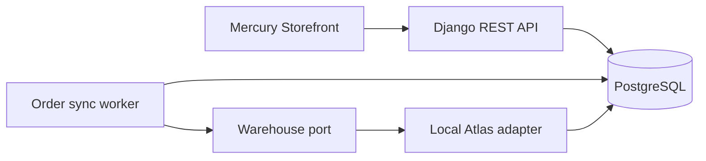

# Local architecture

OrderSync Lab is a small modular Django application backed by PostgreSQL. The accepted domain
and behavior are defined in [domain.md](domain.md).

## Application boundaries

- **Order ingestion** validates the request and atomically creates the order, idempotency
  record, first audit event, and pending job.
- **Order processing** claims due work and owns lifecycle transitions and retry policy.
- **Warehouse port** expresses reservation behavior without depending on an HTTP or AWS client.
- **Local Atlas adapter** supplies deterministic stock and failure behavior for tests and demos.
- **Audit trail** appends safe, structured domain evidence alongside state changes.
- **Status API** reads the aggregate, attempts, inventory projection, and audit timeline.

The domain layer must not import an AWS SDK or a concrete queue client. The database-backed job
source and local warehouse adapter are replaceable infrastructure. This allows a later AWS
decision to be based on the working flow's delivery, security, observability, and cost needs.

## Transaction boundaries

Acceptance is atomic: no successful response is returned unless the order and its pending work
are durable. A warehouse call never occurs while a long database transaction remains open.
After the call, the worker commits the outcome, inventory projection, and audit events together.

Workers must claim jobs safely so two workers cannot process the same due attempt concurrently.
Outbound reservation idempotency still protects Atlas when a worker cannot know whether an
earlier call took effect.

## Current constraint

There are still no business models, workers, queues, AWS SDKs, or cloud resources in the code.
Phase 2 will implement the documented vertical slice and prove it with tests before any AWS
service is selected.

