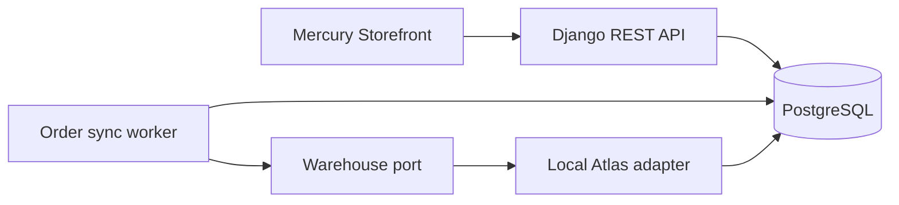

# Local architecture

OrderSync Lab is a small modular Django application backed by PostgreSQL. The accepted domain
and behavior are defined in [domain.md](domain.md).

## Application boundaries

- **Order ingestion** validates the request and atomically creates the order, idempotency
  record, first audit event, and pending job.
- **Order processing** claims due work and owns lifecycle transitions and retry policy.
- **Warehouse port** expresses reservation behavior without depending on an HTTP or AWS client.
- **Local Atlas adapter** supplies deterministic stock and failure behavior for tests and demos.
- **Audit trail** appends safe, structured domain evidence alongside state changes.
- **Status API** reads the aggregate, attempts, inventory projection, and audit timeline.

The domain layer must not import an AWS SDK or a concrete queue client. The database-backed job
source and local warehouse adapter are replaceable infrastructure. This allows a later AWS
decision to be based on the working flow's delivery, security, observability, and cost needs.

## Transaction boundaries

Acceptance is atomic: no successful response is returned unless the order and its pending work
are durable. A warehouse call never occurs while a long database transaction remains open.
After the call, the worker commits the outcome, inventory projection, and audit events together.

Workers must claim jobs safely so two workers cannot process the same due attempt concurrently.
Outbound reservation idempotency still protects Atlas when a worker cannot know whether an
earlier call took effect.

## Current implementation

- Django REST Framework exposes order ingestion, order status, inventory projection, and health
  endpoints.
- PostgreSQL stores orders, idempotency responses, pending jobs, attempts, Atlas stock and
  reservations, inventory projections, and append-only audit events.
- A separate Compose worker claims due jobs with row locks and calls the Atlas boundary outside
  the OrderSync state transaction.
- The local Atlas adapter persists its reservation key and result, so repeating an uncertain
  call cannot decrement stock twice.
- Stale processing locks are recovered after a configurable timeout, and transient failures use
  the documented three-attempt retry policy.

There is no external queue, AWS SDK, or cloud resource. The first cloud target has now been
selected without deploying it: API Gateway and Lambda for the API, a scheduled Lambda worker,
private RDS PostgreSQL, and the existing database-backed job queue. The complete comparison is
in the [AWS architecture evaluation](aws-architecture-evaluation.md), and the decision is
recorded in [ADR 0003](adr/0003-serverless-aws-baseline.md).

Local Docker Compose remains the development and demonstration environment. Cloud adaptation
must preserve the same domain rules, transaction boundaries, and automated tests rather than
creating a second behavior specific to AWS.

