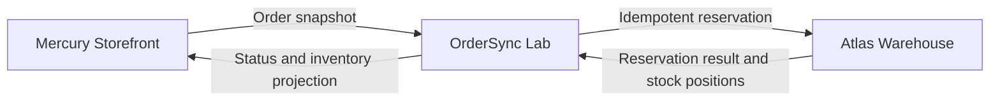
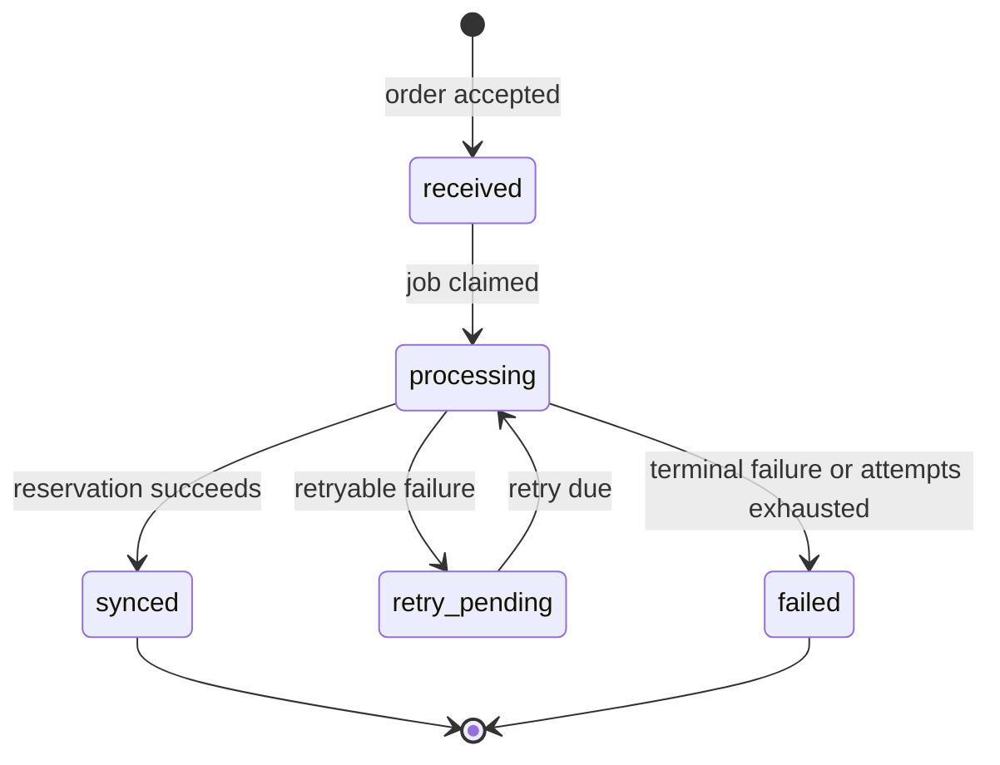

# OrderSync Lab domain definition

- Status: Accepted for the first vertical slice
- Date: 2026-09-27

## Purpose and scope

OrderSync Lab demonstrates how an integration service moves an order between independent
systems without duplicate fulfillment or inventory movements. It also makes failures, retries,
and final outcomes visible to an operator.

All companies, identifiers, products, and data are fictional. The first slice deliberately
contains no personal data, real integrations, AWS resources, or user-facing screens.

## System context

- **Mercury Storefront** owns checkout and the source order identifier. It sends a complete,
  immutable order snapshot.
- **OrderSync Lab** validates and persists the request, prevents duplicates, schedules delivery,
  records transitions, and exposes operational evidence.
- **Atlas Warehouse** owns stock. Its local fake adapter reserves inventory and returns the
  remaining quantity for every accepted line.



OrderSync owns synchronization state, not checkout or physical stock. The fake Atlas contract is
an integration boundary that can later be replaced without changing the order domain.

## First vertical slice

1. Mercury submits an order with a required `Idempotency-Key`.
2. OrderSync validates the complete payload.
3. In one database transaction it stores the order, lines, idempotency record, first audit event,
   and pending synchronization job.
4. The API returns `202 Accepted` with a stable OrderSync identifier.
5. A worker claims the job and calls Atlas with a stable reservation key.
6. Atlas reserves every line, returns a terminal business rejection, or raises a retryable
   technical failure.
7. Success records remaining stock positions and marks the order as synchronized.
8. A retryable failure records the attempt and schedules another without creating a second
   reservation.
9. A status query shows state, attempts, inventory results, and the ordered audit trail.

PostgreSQL is both the state store and durable local job source. A managed queue will be
evaluated only after this workflow works and its requirements are measurable.

## Order contract

The planned ingestion endpoint is `POST /api/v1/orders/`.

```http
Idempotency-Key: mercury:ORD-1001:v1
```

```json
{
  "source": "mercury-storefront",
  "external_order_id": "ORD-1001",
  "placed_at": "2026-09-27T15:30:00Z",
  "currency": "USD",
  "items": [
    {
      "sku": "MUG-BLUE",
      "quantity": 2,
      "unit_price": "12.50"
    }
  ]
}
```

The acceptance response contains the OrderSync UUID, source, external order ID, `received`
status, and `/api/v1/orders/{id}/` status URL.

Contract rules:

- `source` is fixed to `mercury-storefront` in the first slice.
- `external_order_id` is required and unique within a source.
- An order has at least one item, and a SKU appears only once.
- `quantity` is an integer from 1 through 999.
- `unit_price` is a non-negative decimal with two fractional digits.
- `currency` is `USD` in the first slice.
- `placed_at` includes a timezone and cannot be unreasonably far in the future.
- Customer, address, payment, and other personal data are absent.
- Accepted orders are immutable; amendments and cancellations are deferred.

The planned read endpoint is `GET /api/v1/orders/{id}/`. Its exact schema will be frozen by API
tests during implementation.

## Lifecycle



| State | Meaning |
| --- | --- |
| `received` | The order and pending job are durable. |
| `processing` | One worker owns the current attempt. |
| `retry_pending` | A transient failure was recorded and a retry is scheduled. |
| `synced` | Atlas reserved every line once and inventory results are recorded. |
| `failed` | A business failure occurred or automatic retries were exhausted. |

Every state transition appends an audit event in the same transaction as the state change.

## Idempotency rules

| Boundary | Stable key | Required behavior |
| --- | --- | --- |
| Mercury to OrderSync | `(source, Idempotency-Key)` | Same key and canonical payload return the stored response; no order or job is created. |
| Order identity | `(source, external_order_id)` | Same payload resolves to the existing order; changed payload returns `409 Conflict`. |
| OrderSync to Atlas | OrderSync order UUID | A repeated reservation returns its first result and never decrements stock twice. |

Additional rules:

- A missing or malformed idempotency key is rejected.
- Reusing a key with a different payload returns `409` and changes nothing.
- The fingerprint is SHA-256 over canonical domain JSON; whitespace and property order do not
  affect it.
- PostgreSQL uniqueness constraints arbitrate concurrent duplicates.
- Records do not expire in the lab, keeping demonstrations deterministic.
- Replayed API responses include `Idempotency-Replayed: true`.

## Inventory semantics

Atlas begins with seeded fictional balances. A successful all-or-nothing reservation:

- creates one immutable movement per line;
- decreases `available_quantity` once;
- returns the remaining quantity per SKU;
- updates OrderSync's last-known inventory projection; and
- uses the OrderSync UUID as its unique reservation key.

If any line has insufficient stock, Atlas rejects the whole reservation. No line is decremented,
and the order becomes `failed` with reason `insufficient_stock`. The projection is evidence of
the last warehouse response; OrderSync does not claim to own stock.

## Failure and retry policy

| Failure | Classification | Result |
| --- | --- | --- |
| Invalid payload or missing key | Request error | Return `400` and create no order. |
| Key or source order reused with changed data | Conflict | Return `409` and change nothing. |
| Unknown SKU or insufficient stock | Terminal business failure | Mark `failed`; do not retry. |
| Atlas timeout, connection error, `429`, or `5xx` | Retryable technical failure | Record and schedule a retry. |
| Database unavailable before acceptance | Service failure | Return `503`; do not claim acceptance. |
| Three attempts used | Terminal technical failure | Mark `failed` with `retry_exhausted`. |

The first slice permits three total Atlas attempts, with planned delays of 5 and 30 seconds.
Tests use a controlled clock and never sleep. Each attempt stores its number, timestamps,
outcome, safe error code, and next retry time. Stack traces are not returned by the API.

## Audit vocabulary

- `order.received`
- `order.duplicate_detected`
- `sync.attempt_started`
- `sync.retry_scheduled`
- `warehouse.reservation_rejected`
- `warehouse.reservation_succeeded`
- `inventory.projection_updated`
- `order.synced`
- `order.failed`

Events contain an event UUID, order UUID, correlation ID, type, timestamp, and safe JSON
metadata. Authorization data, secrets, and personal data are forbidden.

## Domain invariants

- The accepted order, idempotency record, first event, and pending job commit together or do not
  exist.
- One source order maps to at most one OrderSync order.
- One OrderSync order maps to at most one Atlas reservation.
- A synchronized order has a successful reservation and inventory result for every line.
- A rejected all-or-nothing reservation produces no inventory movement.
- Attempt numbers increase and never exceed three automatically.
- Audit events are append-only.

## Demonstration evidence

The project is demonstrable when these scenarios are reproducible locally:

1. **Happy path:** reach `synced` and inspect the stock reduction and audit history.
2. **Safe replay:** send the same key and payload twice and prove there is one order, job, and
   reservation.
3. **Conflicting replay:** change quantity with the same key and receive `409` without mutation.
4. **Concurrent duplicate:** submit matching requests concurrently and still create one order.
5. **Recoverable outage:** fail Atlas once, observe `retry_pending`, then reach `synced` without
   double-decrementing stock.
6. **Insufficient stock:** fail terminally with no partial movement.
7. **Retry exhaustion:** force three transient failures and inspect every attempt.
8. **Restart durability:** restart after acceptance and process the still-pending job.

API responses, automated tests, database audit records, and structured logs are the evidence.

## Explicit non-goals

- Real commerce, warehouse, payment, shipping, or customer systems.
- Amendments, cancellations, refunds, partial fulfillment, or replenishment.
- Authentication beyond a local trusted-client assumption.
- A message broker, event platform, or AWS resource.
- Multi-region operation or production-scale performance claims.
